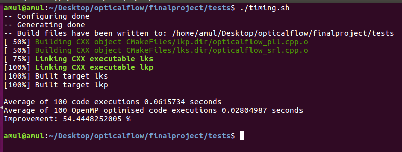

# parallelizationstudy

A performance study of parallelisation on the Lucas-Kanade Optical Flow algorithm.

# Setup

Install openCV as per the official method. Only C/C++ installation is sufficient.

### Modification in OpenCV
* run `cmake-gui` in the `opencv/build` directory and remove all parallel-based optimisations as listed in [pre-condition section](https://docs.opencv.org/trunk/d7/dff/tutorial_how_to_use_OpenCV_parallel_for_.html)
* Click on `configure` and then `generate`
* Run `make -jX` where X is twice the number of your CPU cores ( `make -j8` for a quad core processor)
* Run `sudo make install`

### Clone this project
You're done setting up after this step.

# Usage
* To view the working of optical flow
  * `cmake .`
  * `make -j8`
  * `./lk imX.jpg imY.jpg` (replace X and Y with 1,2 or 3,4)
* To test performance
  * `cd tests`
  * `./timing.sh`

# Results

### Optical Flow

