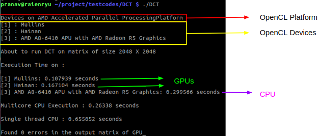

# parallelizationstudy

A performance study of parallelisation on
* Block Matrix Multiplication by [Evan Purkhiser](https://github.com/EvanPurkhiser/CS-Matrix-Multiplication)
* Discrete Cosine Transform used in JPEG Image Compression

# Setup

### Install OpenCL
There are two steps involved in OpenCL installation
* Install OpenCL drivers for your hardware accelerator (usually bundled in the driver package for the GPU)
* Download and install OpenCL sdk following proper instructions specific to your platform

You can check for proper OpenCL installation by running the command `clinfo` in their terminal

### Clone this project
You're done setting up after this step.

# Usage

### Block Matrix Multiplication

```bash
# From root of the cloned repository
cd BMM/

# Generate Makefile
cmake .

# Build the executable
make -j8

# Run the executable
./BMM
```

### Discrete Cosine Transform

```bash
# From root of the cloned repository
cd DCT/

# Generate Makefile
cmake .

# Build the executable
make -j8

# Run the executable
./DCT
```

# Results
The following results were observed on an AMD machine with
* A8-6410 APU (2.0 GHz)
* Radeon R5 M230 / Mullins GPU
* Radeon HD 8500M / Hainan GPU

### An example output of DCT


### Overall Speedup
|Parallelization Technique|Discrete Cosine Transform|Block Matrix Multiplication    |
| ----------------------- |-------------------------| ------------------------------|
| OpenMP                  | 2.49      | 3.981    |
| OpenCL                | 6.121          | 900.866  |

### Block Matrix Multiplication Execution Times in seconds (ET) and Speedups
|Matrix Size  |Single Core ET|Multi Core ET|GPU ET |OpenMP Speedup|OpenCL Speedup|
|-------------|--------------|-------------|-------|----------------|---------------|
| 256X256     | 0.287        | 0.096       | 0.004 |2.99            |71.75          |
| 512X512     | 2.335        | 0.557       | 0.011 |4.192           |212.273        |
| 1024X1024   | 25.358       | 3.856       | 0.038 |6.576           |667.316        |
| 2048X2048   | 201.794      | 50.686      | 0.224 |3.981           |900.866        |


### Discrete Cosine Transform Execution Times in seconds (ET) and Speedups
|Matrix Size  |Single Core ET|Multi Core ET|GPU ET |OpenMP Speedup|OpenCL Speedup|
|-------------|--------------|-------------|-------|----------------|------------|
| 256X256     | 0.01         | 0.025       | 0.007 |0.4             |1.429       |
| 512X512     | 0.043        | 0.027       | 0.017 |1.593           |2.529       |
| 1024X1024   | 0.17         | 0.099       | 0.039 |1.717           |4.359       |
| 2048X2048   | 0.655        | 0.263       | 0.107 |2.49            |6.121       |


# Additional Notes
* If a segmentation fault occurs as soon as you run the executable, it could mean that your OpenCL installation was improper
